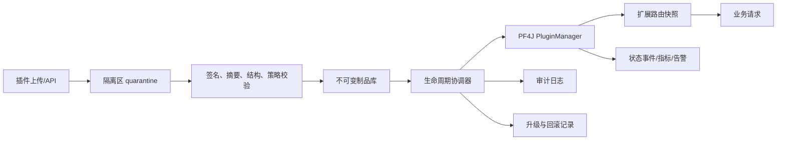
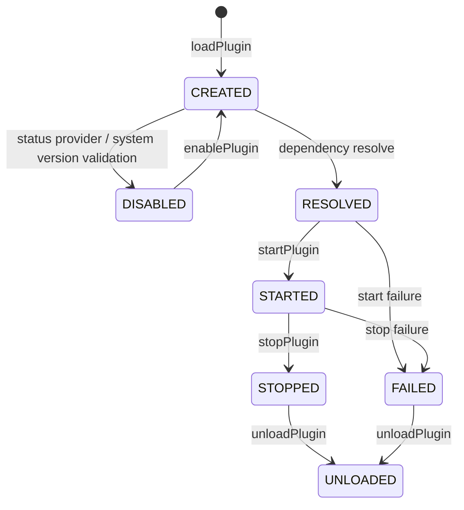
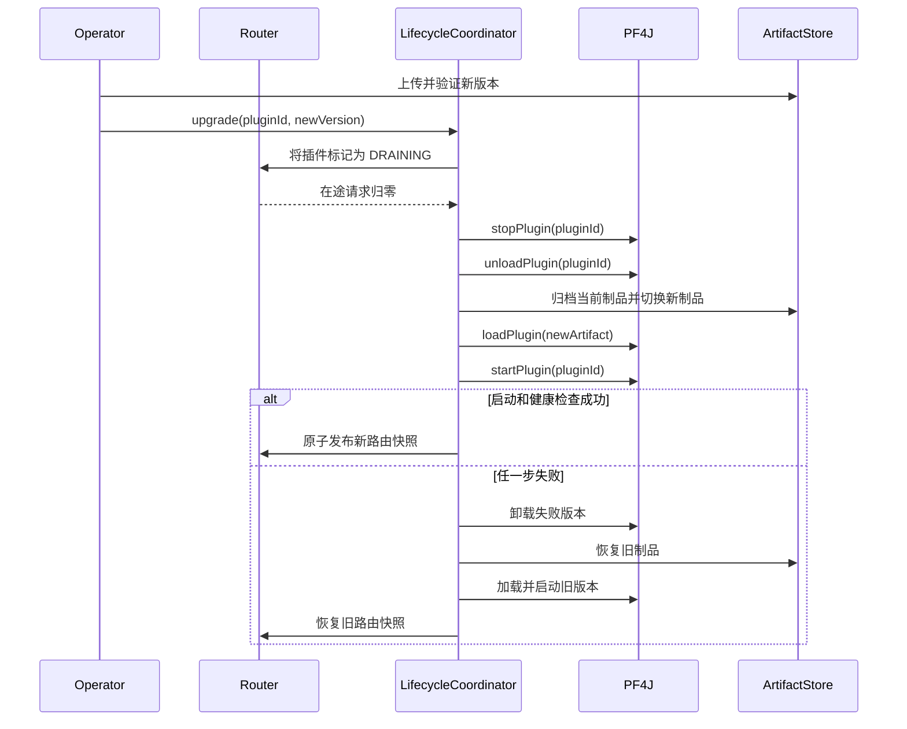

# PF4J 3.15.0 实践（二）：生产级动态插件平台的发布、观测与回滚

## 1. 场景与目标

第一篇解决的是“如何把业务能力做成插件”，本文解决更难的问题：插件已经成为生产系统的一种交付单元后，怎样安全地安装、启动、升级、停用和回滚。

场景假设如下：

- 一个长期运行的 Java 服务需要动态安装支付渠道、设备协议或客户定制插件。
- 插件由内部团队或受信任合作方提供。
- 插件升级不能依赖重启整个宿主。
- 平台需要审计、状态监控、失败诊断和版本回滚。
- 插件之间允许存在必选或可选依赖。

## 2. 先确定责任边界

PF4J 已经提供：

- 插件制品发现和描述符解析。
- 插件依赖图、循环依赖、缺失依赖和版本检查。
- 每插件独立类加载器。
- 创建、解析、启动、停止、禁用、卸载和删除状态流转。
- 扩展索引发现与扩展实例创建。
- 插件状态事件。

生产平台还必须补齐：

- 上传鉴权、发布审批、签名和摘要校验。
- ZIP 炸弹、制品大小、文件数量和许可证检查。
- 生命周期操作串行化和幂等控制。
- 请求流量摘除、在途任务排空和超时强制中止策略。
- 指标、日志、追踪、审计和告警。
- 制品归档、升级事务和失败回滚。
- 插件权限治理；强隔离场景还需要进程或容器边界。

必须明确：`PluginClassLoader` 是类空间隔离手段，不是安全沙箱。插件和宿主运行在同一 JVM，拥有同一进程权限。对于不可信插件，应将插件运行时放入独立进程或容器，通过 RPC 与宿主交互。

## 3. 推荐的生产架构



各层职责不要混在 `Plugin.start()` 中：

| 层 | 职责 |
| --- | --- |
| 制品入口 | 上传鉴权、审批、签名、摘要、大小和格式限制 |
| 制品库 | 以 `pluginId/version/digest` 保存不可变原件 |
| 生命周期协调器 | 串行执行安装、启动、停止、升级和回滚 |
| PF4J | 描述符、依赖、类加载、状态机和扩展发现 |
| 路由层 | 决定新请求是否进入某个插件，并支持原子切换 |
| 观测层 | 状态、耗时、错误、调用量和类加载器泄漏监控 |

## 4. 源码中的生命周期和依赖行为

PF4J 3.15.0 的主要状态如下：



需要关注的真实行为：

1. `loadPlugins()` 会逐个捕获物理加载阶段的 `PluginRuntimeException`，但最后的依赖解析仍可能按默认策略抛出异常。
2. 默认依赖恢复策略是 `THROW_EXCEPTION`；循环依赖始终不可恢复。
3. `startPlugin(id)` 会递归启动依赖。必选依赖失败时当前插件进入 `FAILED`；可选依赖失败时允许降级启动。
4. `startPlugins()` 没有复用上述严格依赖启动结果检查，只按解析列表直接启动。
5. `stopPlugin(id)` 默认先停止依赖该插件的其他插件。
6. `unloadPlugin(id)` 默认递归卸载依赖方，并关闭实现了 `Closeable` 的插件类加载器。
7. `deletePlugin(id)` 的顺序是停止、保留插件实例、卸载、调用 `Plugin.delete()`、删除物理制品。
8. 启动失败不会向调用方重新抛出原异常；应检查返回的 `PluginState` 和 `PluginWrapper.getFailedException()`。
9. `stopPlugins()` 在 3.15.0 中会一边迭代 `startedPlugins`，一边通过 `doStopPlugin()` 从同一列表删除元素，真实运行会触发 `ConcurrentModificationException`。生产关闭流程应复制列表、逆序逐个调用 `stopPlugin(id)`。

这些行为决定了生产平台不能把 `loadPlugins(); startPlugins();` 当作完整发布事务。

## 5. 建立受控的 PluginManager

可以用子类固定生产策略：

```java
package com.acme.plugin.runtime;

import org.pf4j.AbstractPluginManager.ResolveRecoveryStrategy;
import org.pf4j.DefaultPluginManager;
import org.pf4j.ExtensionFactory;
import org.pf4j.SingletonExtensionFactory;

import java.nio.file.Path;

public final class GovernedPluginManager extends DefaultPluginManager {

    public GovernedPluginManager(Path pluginsRoot) {
        super(pluginsRoot);
        setResolveRecoveryStrategy(ResolveRecoveryStrategy.IGNORE_PLUGIN_AND_CONTINUE);
    }

    @Override
    protected ExtensionFactory createExtensionFactory() {
        return new SingletonExtensionFactory(this);
    }
}
```

`IGNORE_PLUGIN_AND_CONTINUE` 适合“单个坏插件不能阻止宿主启动”的平台模式。源码会移除依赖缺失或版本错误的相关插件，然后重新解析；循环依赖仍然抛出异常。若系统属于强一致组合部署，例如一组插件必须全部成功，应该保留默认 `THROW_EXCEPTION`，在外层执行整批回滚。

`SingletonExtensionFactory` 不是必须项。它适合有状态、创建成本高且生命周期与插件一致的扩展。无状态策略插件可以继续使用默认工厂，减少共享状态。

## 6. 所有生命周期变更必须串行化

`AbstractPluginManager` 和 `DefaultPluginManager` 的类注释都明确写着“not thread-safe”。虽然监听器集合的部分方法使用了 `synchronized`，并不代表加载、状态列表、依赖图和类加载器 Map 可以并发修改。

平台应为一个 `PluginManager` 配置一个单写协调器：

```java
package com.acme.plugin.runtime;

import org.pf4j.PluginManager;
import org.pf4j.PluginState;
import org.pf4j.PluginWrapper;

import java.nio.file.Path;
import java.util.Objects;
import java.util.concurrent.locks.Lock;
import java.util.concurrent.locks.ReentrantLock;

public final class PluginLifecycleCoordinator {

    private final PluginManager pluginManager;
    private final Lock lifecycleLock = new ReentrantLock();

    public PluginLifecycleCoordinator(PluginManager pluginManager) {
        this.pluginManager = Objects.requireNonNull(pluginManager, "pluginManager must not be null");
    }

    public String installAndStart(Path verifiedArtifact) {
        Objects.requireNonNull(verifiedArtifact, "verifiedArtifact must not be null");
        lifecycleLock.lock();
        try {
            String pluginId = pluginManager.loadPlugin(verifiedArtifact);
            PluginState state = pluginManager.startPlugin(pluginId);
            if (state.isFailed()) {
                PluginWrapper plugin = pluginManager.getPlugin(pluginId);
                Throwable failure = plugin.getFailedException();
                pluginManager.unloadPlugin(pluginId);
                throw new IllegalStateException("Plugin start failed: " + pluginId, failure);
            }
            return pluginId;
        } catch (RuntimeException ex) {
            throw new IllegalStateException("Plugin installation failed: " + verifiedArtifact, ex);
        } finally {
            lifecycleLock.unlock();
        }
    }

    public void stopAndUnload(String pluginId) {
        Objects.requireNonNull(pluginId, "pluginId must not be null");
        lifecycleLock.lock();
        try {
            PluginState state = pluginManager.stopPlugin(pluginId);
            if (state.isFailed()) {
                Throwable failure = pluginManager.getPlugin(pluginId).getFailedException();
                throw new IllegalStateException("Plugin stop failed: " + pluginId, failure);
            }
            if (!pluginManager.unloadPlugin(pluginId)) {
                throw new IllegalStateException("Plugin unload failed: " + pluginId);
            }
        } finally {
            lifecycleLock.unlock();
        }
    }
}
```

生产实现还应增加：

- `operationId` 和幂等键，避免客户端重试导致重复安装。
- 操作状态表，例如 `PENDING/RUNNING/SUCCEEDED/FAILED/ROLLED_BACK`。
- 每一步超时、错误码和审计上下文。
- 进程级互斥或 Leader 机制，防止集群节点同时修改共享插件目录。
- 不向调用方暴露可变的 `getResolvedPlugins()`、`getUnresolvedPlugins()`、`getStartedPlugins()` 列表；源码返回的是内部列表，应先复制再读取。

## 7. 插件入库前的制品准入

PF4J 的加载入口不是上传安全入口。建议按下面顺序处理制品：

1. 上传到插件根目录之外的隔离区，文件名由服务端生成。
2. 限制上传字节数、压缩条目数、单条目大小和解压总量。
3. 校验 SHA-256，并验证发布方签名或内部制品仓库证明。
4. 检查后缀、MIME、ZIP/JAR 结构，不信任客户端文件名。
5. 预读 `plugin.properties` 或 Manifest，检查 ID、版本、提供方、许可证和宿主版本约束。
6. 扫描禁止类、已知漏洞依赖和重复打包的宿主 API。
7. 在隔离测试进程中执行加载、启动、契约测试、停止和卸载。
8. 通过后写入不可变制品库，再原子移动或复制到运行目录。

PF4J 3.15.0 的 `Unzip` 已检查规范化后的目标路径，能阻止 `../` 路径穿越，但没有承担完整的制品准入职责。压缩比、磁盘配额、签名和恶意字节码仍由平台处理。

## 8. 发布流程：不要直接覆盖运行中的 JAR

PF4J 会拒绝重复路径和重复插件 ID。相同 ID 的新旧版本不能在同一 `PluginManager` 中直接并存。推荐升级事务：



关键点：

- 流量摘除发生在停止插件之前，否则已有请求仍可能调用即将卸载的实例。
- `stopPlugin` 和 `unloadPlugin` 会影响依赖方，升级前必须从依赖图计算影响面。
- 新插件进入 `STARTED` 后还要执行健康检查，不能仅把状态当作业务可用证明。
- 路由表使用不可变快照和原子替换；不要边遍历边修改扩展集合。
- 旧制品至少保留一个回滚窗口，不能用 `deletePlugin` 作为升级第一步。
- 失败回滚也可能失败，平台必须保留 `DEGRADED` 或 `MANUAL_INTERVENTION` 状态和告警。

## 9. 插件必须实现可卸载的资源纪律

PF4J 卸载时会关闭插件类加载器，但类加载器能否被 GC，取决于外部是否仍然持有插件对象或类。插件的 `stop()` 至少要完成：

- 停止并等待自建线程池、定时器和消费者线程。
- 清除线程上下文类加载器引用。
- 注销宿主事件监听器、MBean、JDBC Driver 和日志 Appender。
- 关闭连接池、HTTP 客户端、文件、Socket 和 WatchService。
- 清理宿主静态 Map、缓存和路由表中的扩展实例。
- 清理插件创建的 `ThreadLocal`。
- 阻止新请求进入，并等待已进入调用完成。

推荐为插件上下文提供统一资源注册表：插件创建资源时登记，停止时由宿主按逆序关闭。只依赖每个插件作者手写清理逻辑，长期运行后很容易出现类加载器泄漏。

## 10. 状态持久化不要直接照搬默认文件方案

`DefaultPluginStatusProvider` 在初始化时读取：

- `enabled.txt`：非空时表现为白名单。
- `disabled.txt`：黑名单。

源码实现有几个运维注意点：

1. 文件只在 provider 创建时读取，外部修改不会自动刷新。
2. `enabledPlugins` 为空时白名单逻辑不生效，会把未列出的插件也视为启用。
3. 只要 `enabled.txt` 文件存在，`disablePlugin` 就从 enabled 列表删除；如果删除后列表变空，下一次判断会退化为“全部不因白名单禁用”。
4. 默认 provider 只保存启用/禁用，不保存发布版本、摘要、操作者、审批或回滚状态。

因此生产平台更适合实现自己的 `PluginStatusProvider`，将期望状态和实际状态分开保存：

```text
desired_state: ENABLED / DISABLED
actual_state:  CREATED / RESOLVED / STARTED / STOPPED / FAILED / UNLOADED
artifact:       pluginId + version + sha256 + storageUri
operation:      operator + operationId + timestamp + reason
```

数据库只是控制面真相来源，真正调用 PF4J 的生命周期协调器仍必须保证单写和幂等。

## 11. 依赖和版本治理

### 11.1 宿主版本

启动时必须设置：

```java
pluginManager.setSystemVersion(applicationVersion);
```

默认 `0.0.0` 会跳过 `plugin.requires` 检查。建议插件显式写范围表达式，不依赖纯 `x.y.z` 被默认改写成 `>=x.y.z` 的兼容行为。

### 11.2 插件依赖

```properties
plugin.dependencies=protocol-core@>=3.0.0,metrics-bridge?@>=1.5.0
```

- 必选依赖进入依赖图，参与拓扑排序、缺失和版本校验。
- 可选依赖不进入依赖图，缺失时不会阻止解析。
- 可选依赖存在但启动失败时，依赖方仍可降级启动。
- 使用可选依赖的插件代码不能在无保护的类初始化路径中直接引用可选类，否则可能在扩展发现时触发 `NoClassDefFoundError`。

扩展可以用 `@Extension(plugins = {...})` 再声明扩展级前置插件，但该检查依赖可选 ASM。若平台依赖这个能力，应显式构造 `IndexedExtensionFinder`、调用 `setCheckForExtensionDependencies(true)`，并把 ASM 固定在宿主依赖中。

### 11.3 API 兼容

为每个公开扩展 API 维护：

- API 语义化版本和兼容矩阵。
- 二进制兼容检查，例如禁止删除公开方法。
- 插件契约测试套件。
- 最低和最高宿主版本策略。
- 序列化 DTO 的向前、向后兼容规则。

## 12. 类加载治理

默认 `PluginClassLoader`：

- `java.*` 始终走系统类加载器。
- `org.pf4j.*` 默认委派给父加载器，避免插件携带自己的 PF4J 核心副本。
- 其他类默认按 `Plugin -> Dependencies -> Application` 查找。
- 依赖插件的类通过其插件类加载器查找。

生产建议：

1. 宿主 SPI/API 只在父类加载器存在，插件依赖使用 `provided`。
2. 插件私有三方依赖放在自己的 JAR 或 `lib/`，避免污染宿主。
3. 需要跨插件共享的实现库应建成显式基础插件并声明依赖，不要依赖“碰巧在宿主 classpath”。
4. 不同插件携带不同版本的私有库是允许的，但跨插件传递的对象类型必须来自共享 API。
5. 使用 `ServiceLoader` 或资源合并时要验证资源加载顺序；`extensions.idx` 在源码中被特别改为 `PAD` 顺序读取，防止索引被依赖插件覆盖。
6. 自定义策略时，通过自定义 `PluginLoader` 覆盖 `createPluginClassLoader`，不要在业务代码里反射修改类加载器。

## 13. 可观测性设计

### 13.1 状态事件

```java
pluginManager.addPluginStateListener(event -> {
    try {
        PluginWrapper plugin = event.getPlugin();
        Throwable failure = plugin.getFailedException();
        pluginEventQueue.offer(new PluginEvent(
            plugin.getPluginId(),
            plugin.getDescriptor().getVersion(),
            event.getOldState(),
            event.getPluginState(),
            failure));
    } catch (RuntimeException ignored) {
        // 监听器不能反向破坏生命周期操作
    }
});
```

状态监听器由生命周期调用线程同步执行，`firePluginStateEvent` 不会为单个监听器捕获异常。监听器中不要做远程请求或慢 I/O，应快速写入内存队列，并在内部兜底异常。

状态没有变化时源码不会发送事件。因此监控系统还需要周期性对账，而不是只依赖事件流。

### 13.2 推荐指标

| 指标 | 标签建议 | 用途 |
| --- | --- | --- |
| `plugin_state` | plugin_id, version, state | 当前状态 |
| `plugin_lifecycle_duration` | operation, result | 发布和回滚耗时 |
| `plugin_lifecycle_failures_total` | operation, error_type | 生命周期失败 |
| `plugin_invocations_total` | plugin_id, extension_point, result | 插件调用量 |
| `plugin_invocation_duration` | plugin_id, extension_point | 性能和超时 |
| `plugin_inflight` | plugin_id | 流量摘除和排空依据 |
| `plugin_classloader_live` | plugin_id, version | 卸载泄漏检测 |

不要把客户 ID、订单号等高基数字段直接作为指标标签；它们应进入日志或追踪属性。

### 13.3 日志与追踪

每次生命周期操作至少记录：

- `operationId`、`pluginId`、版本、摘要和操作者。
- 旧状态、新状态、开始时间、结束时间和结果。
- 依赖图影响范围。
- 失败异常链和回滚结果。
- 制品库 URI，但不记录密钥和签名私钥。

业务调用应在宿主边界创建 span，并把 `plugin.id`、`plugin.version`、扩展点和调用结果作为低基数属性。

## 14. 故障模式与处理策略

| 故障 | PF4J 行为 | 平台处理 |
| --- | --- | --- |
| 描述符缺少 ID/版本 | 加载失败 | 制品准入阶段拒绝 |
| 插件 ID 重复 | 抛出已加载异常 | 走升级事务，不直接并存 |
| 缺失必选依赖 | 默认解析抛异常 | 整批失败或隔离坏插件 |
| 循环依赖 | 始终抛异常 | 阻断发布，修正依赖图 |
| `Plugin.start()` 抛异常或链接错误 | 状态变为 `FAILED` | 读取 failedException，卸载并回滚 |
| 可选依赖启动失败 | 依赖方继续启动 | 标记降级并告警 |
| 调用 `stopPlugins()` | 3.15.0 会触发并发修改异常 | 复制已启动列表，逆序逐个 `stopPlugin(id)` |
| `Plugin.stop()` 失败 | 可能进入 `FAILED` 或异常上抛 | 保持流量摘除状态，禁止删除，人工介入 |
| 类加载器关闭后仍被引用 | JVM 无法回收 | 检查线程、静态缓存、监听器和 TCCL |
| 监听器抛异常 | 可能中断当前生命周期调用 | 监听器内部兜底并异步处理 |
| 外部修改 enabled/disabled 文件 | 不自动刷新 | 统一走控制面 API |

## 15. 上线前验证矩阵

### 功能验证

- [ ] 空插件目录启动。
- [ ] 单插件安装、启动、调用、停止和卸载。
- [ ] 必选依赖成功与失败。
- [ ] 可选依赖缺失与启动失败降级。
- [ ] 循环依赖、错误版本和重复 ID。
- [ ] 扩展索引缺失、扩展构造失败和插件链接错误。

### 发布与回滚

- [ ] 升级前完成流量摘除和在途请求排空。
- [ ] 新版本启动失败回滚。
- [ ] 新版本健康检查失败回滚。
- [ ] 回滚版本也失败时进入人工介入状态。
- [ ] 依赖插件升级时，依赖方按预期停止和恢复。

### 稳定性与安全

- [ ] 并发安装、停止和升级请求被串行化。
- [ ] 大文件、ZIP 炸弹、路径穿越和错误签名被拒绝。
- [ ] 连续升级 100 次后旧类加载器可以被回收。
- [ ] 插件线程、连接、监听器和 ThreadLocal 均能清理。
- [ ] 插件慢调用、异常、超时不会拖垮宿主线程池。
- [ ] 不可信插件通过独立进程运行。

## 16. 使用 pf4j-extension 直接落地

本文前面的生产治理要求已经在三个模块中形成可组合实现：

| 治理环节 | 对应实现 |
| --- | --- |
| 严格启动、串行生命周期、失败回滚 | `PluginLifecycleManager` |
| 生命周期审计 | `PluginLifecycleListener`、`PluginOperationResult` |
| 扩展注册表和冲突检查 | `ExtensionCatalog` |
| 调用日志、耗时、追踪和容错切面 | `ExtensionInvoker`、`ExtensionInterceptor` |
| 健康、就绪和更新前流量摘除 | `PluginHealthService` 及三个治理扩展点 |
| 类来源、依赖方、失败和重复宿主 API 诊断 | `PluginDiagnostics` |
| Spring Bean/Controller 随插件状态注册和注销 | `PluginBeanRegistry`、`SpringPluginLifecycleSynchronizer` |
| 下载协议、摘要、大小、压缩结构和禁止类校验 | `SecureFileDownloader`、`PluginArtifactVerifier` |
| 发布方离线签名校验 | `DetachedSignatureVerificationPolicy`、`SignatureProvider` |
| 制品备份、原子替换、健康提交和失败回滚 | `TransactionalPluginUpdateManager`、`FileSystemPluginArtifactStore` |

推荐装配顺序是：

1. 使用 `DownloadPolicy` 固化平台准入限制，并把安全下载器和验证器注入更新仓库。
2. 为每个 `PluginManager` 创建唯一的 `PluginLifecycleManager`，所有生命周期入口都经过它。
3. 宿主调用扩展时统一经过 `ExtensionInvoker`，在此接入指标、追踪和熔断实现。
4. 插件提供健康、就绪和流量摘除扩展；没有声明时默认视为通过，严格平台可以在发布规则层强制要求。
5. 使用 `TransactionalPluginUpdateManager` 执行安装和升级；旧的 `installPlugin/updatePlugin` 兼容入口也会转入同一事务流程。
6. Spring 应用使用 `ExtendedSpringPluginManager`，插件停止、失败或卸载时同步销毁 Bean 和请求映射。
7. 运维接口只返回 `ExtensionCatalog` 和 `PluginDiagnosticReport` 这类宿主基础类型对象，避免长期持有插件实例或插件 `Class`。

`FileSystemPluginArtifactStore` 当前面向 JAR/ZIP 普通文件制品。若生产环境使用对象存储、共享文件系统或内容寻址仓库，应实现 `PluginArtifactStore`，保留“备份、激活、恢复、清理”语义，并在集群控制面增加分布式锁或单 Leader 写入约束。

## 17. 最终建议

把 PF4J 用到生产，不应围绕“扫描一个 plugins 目录”设计，而应围绕“受控制品 + 单写状态机 + 原子路由 + 可回滚发布”设计。

PF4J 3.15.0 已经把插件发现、依赖图、类加载器和生命周期骨架做得足够清晰；平台真正的工程价值在外围治理：

1. 插件进入运行目录前已经可信、可追溯、可回放。
2. 所有生命周期变更串行、幂等且有审计。
3. 新旧版本切换发生在路由层，而不是靠覆盖 JAR 碰运气。
4. 每次失败都能定位到插件、版本、依赖和原始异常。
5. 每次卸载都以资源释放和类加载器回收为完成标准。

达到这些条件后，PF4J 才从一个嵌入式插件框架，变成可长期运维的生产插件平台基础。
